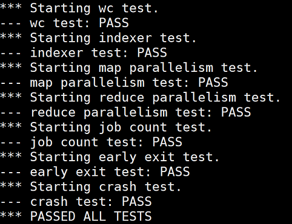
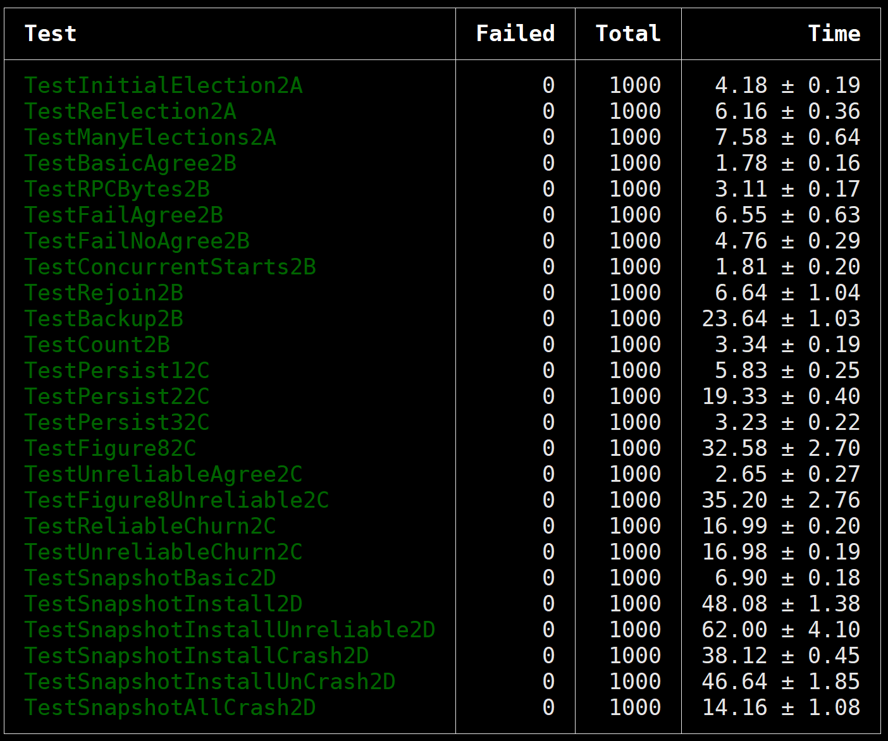
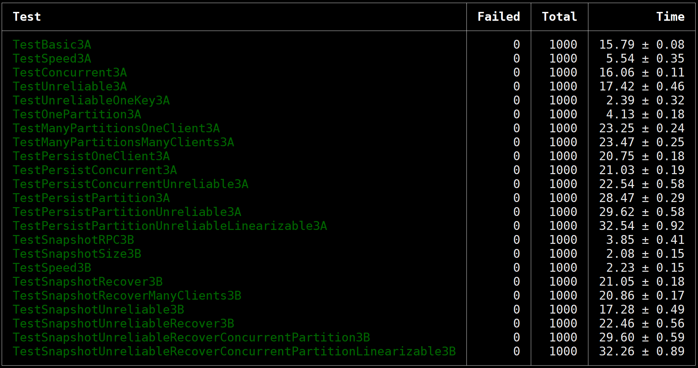
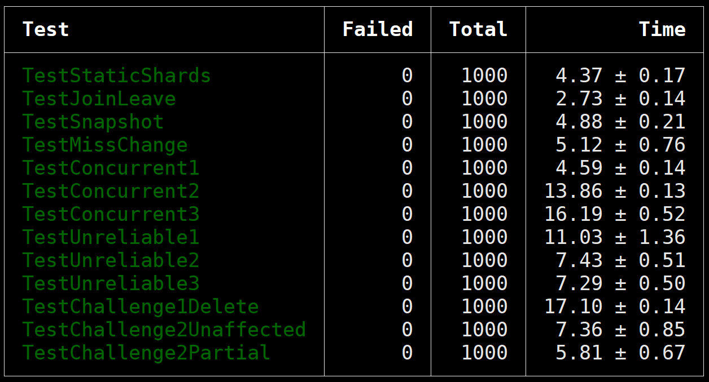

# MIT6.824 2022

## 文档

- [x] [Lab1](docs/lab1.md)
- [x] [Lab2](docs/lab2.md)
- [x] [Lab3](docs/lab3.md)
- [x] [Lab4](docs/lab4.md)
    - [x] [Challenge1](docs/lab4.md)
    - [x] [Challenge2](docs/lab4.md)

## 结果

### Lab1

### Lab2

### Lab3

### Lab4

